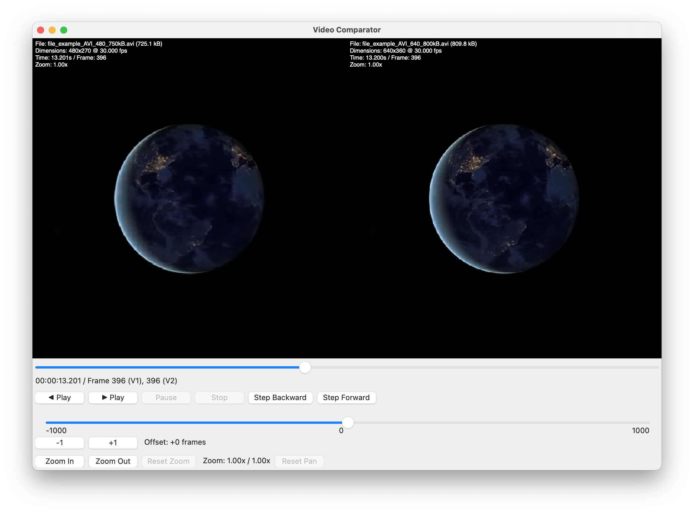

# Video Comparator

A cross-platform GUI application for frame-accurate, side-by-side visual comparison of two video files. Designed for expert video quality evaluation with precise frame-by-frame analysis capabilities.

## License

Apache 2.0
